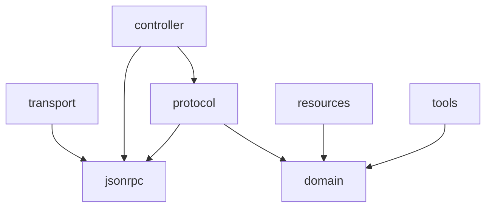

## mcp_rs
### article
[Rustで自作MCPサーバー](https://zenn.dev/taro137/articles/0b21b2b6757951)

### usage
```sh
bunx @modelcontextprotocol/inspector cargo run -qr
```

### architecture
#### workspace members
| name | description |
| - | - |
| controller | method-handler mapping |
| domain | core entities and repository traits |
| jsonrpc | JSON-RPC 2.0 definition |
| protocol | usecase definitions |
| resources | resources implementation |
| tools | tools implementation |
| transport | stdio implementation |

#### dependency graph

